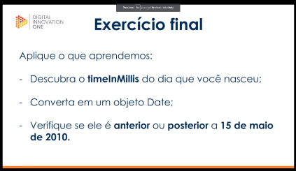
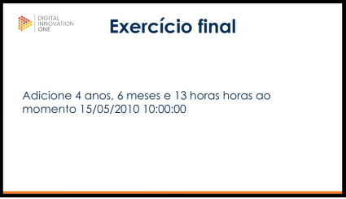

# Exercícios propostos na aula de java básico.

##### Trabalhando com Datas

- Exercício 01 java.util.Date
- 
- Exercício 02 java.util.Calendar
- 
- Exercício 03 Classe DateFormat
- 
- Exercício 04 Conhecendo date a partir do java 8
- 

